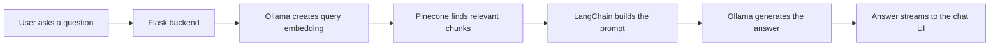

# AI Engineering Chatbot

This is a local AI Engineering chatbot built with Flask, LangChain, Ollama, and Pinecone.

It helps users learn concepts like machine learning, deep learning, RAG, LLMs, embeddings, vector databases, AI agents, evaluation, and MLOps. The chatbot uses Retrieval-Augmented Generation, so it first searches your knowledge base and then answers using the most relevant context.

The LLM and embedding model run locally through Ollama. Pinecone is used as the vector database.

## What This Project Does

- Lets users chat with an AI Engineering tutor.
- Uses local Ollama models for generation and embeddings.
- Stores AI learning documents in Pinecone as vectors.
- Retrieves relevant context before answering.
- Streams responses in the browser.
- Includes a stop-generation button like ChatGPT.
- Handles casual greetings naturally.
- Avoids answering random unsupported inputs from unrelated context.

## Tech Stack

- Python 3.13
- Flask
- LangChain
- Ollama
- Pinecone
- HTML, CSS, and JavaScript

## Models Used

Use these Ollama models:

```bash
ollama pull qwen2.5:7b-instruct
ollama pull nomic-embed-text
```

`qwen2.5:7b-instruct` is used for chat responses.

`nomic-embed-text` is used to convert documents and questions into embeddings for retrieval.

Optional faster fallback:

```bash
ollama pull llama3.2
```

## Project Structure

```text
ai-engineering-chatbot/
  app/
    config.py
    routes.py
    rag/
      document_loader.py
      prompts.py
      service.py
      vector_store.py
    static/
      css/styles.css
      js/chat.js
    templates/
      index.html
  data/
    raw/
      ai_engineering_guide.md
  scripts/
    check_ollama.py
    create_pinecone_index.py
    ingest.py
  tests/
  .env.example
  requirements.txt
  run.py
```

## Setup

Clone the project and move into the folder:

```bash
cd ai-engineering-chatbot
```

Create and activate a virtual environment:

```bash
python3 -m venv .venv
source .venv/bin/activate
```

Install dependencies:

```bash
python -m pip install --upgrade pip
pip install -r requirements.txt
```

## Environment Variables

Create your `.env` file:

```bash
cp .env.example .env
```

Open `.env` and add your Pinecone API key:

```env
PINECONE_API_KEY=your-pinecone-api-key
PINECONE_INDEX_NAME=ai-engineering-chatbot-768
PINECONE_NAMESPACE=ai-engineering
```

You do not need an OpenAI API key. This project uses Ollama locally.

## Run The Project

First, make sure Ollama is running.

Check that the models work:

```bash
python scripts/check_ollama.py
```

Create the Pinecone index:

```bash
python scripts/create_pinecone_index.py
```

Add the AI Engineering knowledge base to Pinecone:

```bash
python scripts/ingest.py
```

Start the Flask app:

```bash
python run.py
```

Open this in your browser:

```text
http://127.0.0.1:5000
```

## Example Questions

Try asking:

```text
What is RAG?
```

```text
Explain embeddings in simple terms.
```

```text
What is the difference between RAG and fine-tuning?
```

```text
How do vector databases help LLM applications?
```

```text
Explain MLOps vs LLMOps.
```

## Adding More Knowledge

The starter document is here:

```text
data/raw/ai_engineering_guide.md
```

You can add more `.md`, `.txt`, or `.pdf` files inside:

```text
data/raw/
```

Good content to add:

- ML notes
- Deep learning notes
- RAG architecture notes
- LLM prompting notes
- Vector database notes
- AI agent notes
- Evaluation notes
- MLOps notes

After adding new files, run:

```bash
python scripts/ingest.py --clear-namespace
```

## Run Tests

```bash
python -m compileall app scripts run.py
python -m unittest discover -s tests
```

## How It Works



## Notes

Keep your `.env` file private. It contains your Pinecone API key and should not be pushed to GitHub.

The project is meant for learning and portfolio use. The quality of the chatbot depends heavily on the quality of documents you add to `data/raw`.
