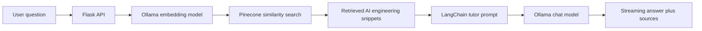

# AI Engineering Chatbot

An end-to-end Retrieval-Augmented Generation chatbot that teaches AI engineering concepts such as machine learning, deep learning, embeddings, vector databases, RAG, LLMs, agents, prompt engineering, evaluation, MLOps, and LLMOps.

The app runs the language model and embedding model locally through Ollama, stores document vectors in Pinecone, retrieves the most relevant AI engineering snippets, and then asks the local LLM to answer like a practical tutor.

This project is designed for learning, portfolio demos, and experimentation. Treat the generated answers as educational assistance, not as a replacement for reading source documentation, papers, and production system requirements.

## Recommended Ollama Models

Use these first on your MacBook Air M4:

1. `qwen2.5:7b-instruct`
   - Use for answer generation.
   - Good fit because it is strong at instruction following, explanations, and structured answers.
   - It is larger than `llama3.2`, so it may be slower, but it usually gives better teaching-style responses.

2. `nomic-embed-text`
   - Use for document embeddings.
   - Good fit because it is a dedicated embedding model, small to download, and works well for semantic retrieval.
   - The ingestion script probes its vector dimension automatically before creating the Pinecone index.

Optional fallback:

3. `llama3.2`
   - Use if `qwen2.5:7b-instruct` feels slow on your machine.
   - It is smaller and suitable for local summarization, Q&A, and learning workflows.

References:

- Ollama `qwen2.5:7b-instruct`: https://ollama.com/library/qwen2.5:7b-instruct
- Ollama `llama3.2`: https://ollama.com/library/llama3.2
- Ollama `nomic-embed-text`: https://ollama.com/library/nomic-embed-text
- LangChain Ollama integration: https://reference.langchain.com/python/langchain-ollama
- LangChain Pinecone integration: https://docs.langchain.com/oss/python/integrations/vectorstores/pinecone
- Pinecone index creation: https://docs.pinecone.io/guides/index-data/create-an-index

## Folder Structure

```text
ai-engineering-chatbot/
  app/
    __init__.py
    config.py
    routes.py
    rag/
      __init__.py
      document_loader.py
      errors.py
      prompts.py
      schemas.py
      service.py
      vector_store.py
    static/
      css/styles.css
      js/chat.js
    templates/
      index.html
  data/
    raw/
      ai_engineering_guide.md
  scripts/
    check_ollama.py
    create_pinecone_index.py
    ingest.py
  tests/
    test_config.py
    test_prompts.py
  .env.example
  .gitignore
  pyproject.toml
  README.md
  requirements.txt
  run.py
```

## What Each Part Does

`app/config.py`

Loads environment variables from `.env` into a typed `Settings` object.

`app/rag/vector_store.py`

Connects Ollama embeddings to Pinecone. It creates the Pinecone index when needed and validates that the index dimension matches the embedding model.

`app/rag/document_loader.py`

Loads `.md`, `.txt`, and `.pdf` files from `data/raw`, splits them into chunks, and creates stable vector IDs.

`app/rag/service.py`

Coordinates retrieval and generation. It retrieves relevant chunks from Pinecone, formats context, and calls the local Ollama chat model.

`app/rag/prompts.py`

Stores the AI engineering tutor prompt. The prompt tells the model to use retrieved context, teach step by step, connect ideas to engineering practice, and separate facts from assumptions.

`app/routes.py`

Defines Flask routes for the page, health check, normal chat API, and streaming chat API.

`app/templates/index.html`, `app/static/css/styles.css`, `app/static/js/chat.js`

The browser chat interface.

`scripts/check_ollama.py`

Tests that Ollama is running and both models respond.

`scripts/create_pinecone_index.py`

Creates or validates the Pinecone index.

`scripts/ingest.py`

Loads AI engineering documents, splits them, embeds them locally with Ollama, and upserts vectors into Pinecone.

## Step 1: Check Python

On macOS Terminal:

```bash
python3 --version
```

This project has been checked with Python 3.13.6 on macOS. You can use your existing Python version for the local setup.

If `python3 --version` does not show Python 3.13.x on another machine, install Python with Homebrew:

```bash
brew install python
```

## Step 2: Install Ollama Models

You already installed Ollama, so pull the models:

```bash
ollama pull qwen2.5:7b-instruct
ollama pull nomic-embed-text
```

Optional fallback model:

```bash
ollama pull llama3.2
```

Test the chat model:

```bash
ollama run qwen2.5:7b-instruct "Explain RAG in one sentence."
```

Test the embedding model:

```bash
curl http://localhost:11434/api/embed \
  -d '{"model":"nomic-embed-text","input":"AI engineering chatbots retrieve relevant technical context before answering."}'
```

If the `curl` command returns a JSON response with `embeddings`, the embedding model is working.

## Step 3: Create a Virtual Environment

From the project root:

```bash
python3 -m venv .venv
source .venv/bin/activate
python -m pip install --upgrade pip
pip install -r requirements.txt
```

Activate the virtual environment every time you work on the project:

```bash
source .venv/bin/activate
```

## Step 4: Configure Environment Variables

Create your local `.env` file:

```bash
cp .env.example .env
```

Open `.env` and set:

```env
PINECONE_API_KEY=your-real-pinecone-api-key
PINECONE_INDEX_NAME=ai-engineering-chatbot-768
PINECONE_NAMESPACE=ai-engineering
OLLAMA_LLM_MODEL=qwen2.5:7b-instruct
OLLAMA_EMBEDDING_MODEL=nomic-embed-text
```

To get a Pinecone API key:

1. Create or open your Pinecone account.
2. Create an API key from the Pinecone console.
3. Paste it into `.env`.

Recommended Pinecone settings for this beginner project:

```env
PINECONE_CLOUD=aws
PINECONE_REGION=us-east-1
PINECONE_METRIC=cosine
AUTO_CREATE_INDEX=true
```

The project creates a dense vector index because Ollama produces the vectors locally.

## Step 5: Test Ollama from Python

Run:

```bash
python scripts/check_ollama.py
```

Expected result:

- You see installed Ollama models.
- You see a short response from the chat model.
- You see an embedding vector dimension greater than 0.

If this fails:

- Make sure Ollama is open or running.
- Run `ollama list` and confirm the model names match `.env`.
- If `qwen2.5:7b-instruct` is slow, switch `.env` to `OLLAMA_LLM_MODEL=llama3.2`.

## Step 6: Create the Pinecone Index

Run:

```bash
python scripts/create_pinecone_index.py
```

This script:

1. Calls Ollama to find the embedding vector dimension.
2. Creates the Pinecone index if it does not exist.
3. Verifies that an existing index has the correct dimension.

If you change `OLLAMA_EMBEDDING_MODEL`, use a new `PINECONE_INDEX_NAME` or recreate the old index. Pinecone indexes cannot store mixed vector dimensions.

## Step 7: Ingest Documents

A starter AI engineering file already exists:

```text
data/raw/ai_engineering_guide.md
```

Ingest it:

```bash
python scripts/ingest.py
```

To replace or expand the starter knowledge base:

1. Add `.md`, `.txt`, or `.pdf` files into `data/raw`.
2. Run:

```bash
python scripts/ingest.py --clear-namespace
```

Good source material for this chatbot:

- Your own ML and deep learning notes.
- RAG architecture notes.
- LLM prompting examples.
- Vector database notes.
- AI agent design notes.
- Evaluation checklists.
- MLOps and LLMOps runbooks.
- Research paper summaries written in your own words.

## Step 8: Run the Flask App

Start the development server:

```bash
python run.py
```

Open:

```text
http://127.0.0.1:5000
```

Try:

```text
Explain RAG like I am building my first AI engineering project.
```

Other good starter questions:

```text
What is the difference between RAG and fine-tuning?
How do embeddings and vector databases work together?
What should I evaluate in an LLM application?
Explain MLOps vs LLMOps.
```

You should see:

- A streamed answer from the local Ollama model.
- Retrieved source snippets from Pinecone in the side panel.

## API Testing

Health check:

```bash
curl http://127.0.0.1:5000/api/health
```

Chat endpoint:

```bash
curl -X POST http://127.0.0.1:5000/api/chat \
  -H "Content-Type: application/json" \
  -d '{"message":"What is the difference between RAG and fine-tuning?","history":[]}'
```

## Run Checks

After installing dependencies:

```bash
python -m compileall app scripts run.py
python -m unittest discover -s tests
pytest
```

## Debugging Guide

Problem: `PINECONE_API_KEY is missing`

Fix: Add your real key to `.env`.

Problem: Ollama model not found

Fix:

```bash
ollama list
ollama pull qwen2.5:7b-instruct
ollama pull nomic-embed-text
```

Problem: Pinecone dimension mismatch

Cause: You created the index with one embedding model and then switched to another.

Fix: Change `PINECONE_INDEX_NAME` in `.env`, or delete and recreate the Pinecone index.

Problem: Answers ignore your documents

Fix:

1. Confirm ingestion finished successfully.
2. Confirm you are using the same `PINECONE_INDEX_NAME` and `PINECONE_NAMESPACE` in `.env`.
3. Add better source documents to `data/raw`.
4. Increase `RETRIEVER_TOP_K` slightly, for example from `4` to `6`.

Problem: The app is slow

Fix:

1. Use `OLLAMA_LLM_MODEL=llama3.2`.
2. Reduce `RETRIEVER_TOP_K`.
3. Keep document chunks focused.

## Production Notes

For a real deployment, you should add:

- User authentication.
- Rate limiting.
- Request logging and monitoring.
- Prompt and retrieval evaluation.
- HTTPS.
- Error tracking.
- A managed Ollama host or another production LLM provider.
- Data governance for any private learning material or company documents.

Run with Gunicorn:

```bash
gunicorn "app:create_app()" --bind 0.0.0.0:5000 --workers 2 --threads 4
```

If deploying to a cloud service, remember that the Flask app must be able to reach Ollama. Running Ollama only on your laptop works for local development, not for a hosted web app unless the app is also running on the same machine or a reachable private server.

## Architecture



## Next Improvements

- Add document upload from the UI.
- Add topic filters for ML, DL, RAG, LLMs, agents, and MLOps.
- Add flashcards or quizzes generated from retrieved context.
- Add evaluation questions for retrieval quality.
- Add a local vector store option such as Chroma for offline demos.
- Add authentication before exposing the app outside your machine.
