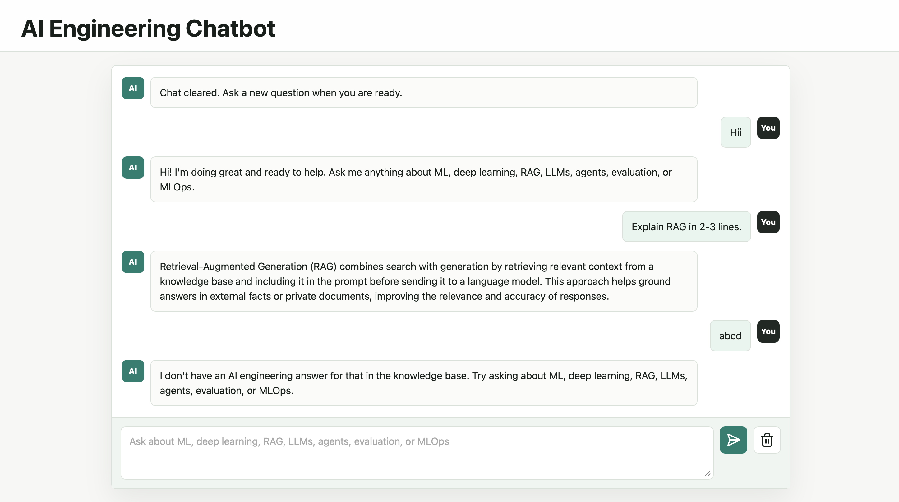

# AI Engineering Chatbot

## Project Overview

In this project, I built an AI Engineering chatbot using Flask, LangChain, Ollama, and Pinecone. The chatbot is designed to explain concepts related to machine learning, deep learning, RAG, LLMs, embeddings, vector databases, AI agents, evaluation, and MLOps.

The main goal of this project was to understand how Retrieval-Augmented Generation works in a real application. Instead of only depending on the language model's internal knowledge, the chatbot retrieves relevant information from a vector database and then generates an answer using that context.

This project helped me practically explore concepts like document ingestion, embeddings, vector search, prompt engineering, local LLM usage, and real-time chat response streaming.

## Project Screenshot



## Objective

- To build an AI tutor chatbot for AI Engineering concepts
- To implement Retrieval-Augmented Generation using LangChain
- To use Ollama models locally for chat and embeddings
- To store and retrieve knowledge using Pinecone vector database
- To build a clean Flask backend with a simple interactive frontend
- To understand how LLM applications are structured end to end

## System Architecture

The project follows a modular RAG-based architecture:

- Flask handles the backend routes and API communication
- LangChain manages the RAG workflow
- Ollama runs the local LLM and embedding model
- Pinecone stores document embeddings and performs similarity search
- HTML, CSS, and JavaScript create the chat interface

Basic flow:

```text
User Question
      ↓
Flask Backend
      ↓
Ollama Embedding Model
      ↓
Pinecone Vector Search
      ↓
Relevant Context
      ↓
LangChain Prompt
      ↓
Ollama Chat Model
      ↓
Final Chatbot Response
```

## Features

- Interactive AI Engineering chatbot
- Local LLM support using Ollama
- RAG-based answer generation
- Pinecone vector database integration
- Real-time streaming responses
- Stop generation button
- Beginner-friendly AI concept explanations
- Clean and modular code structure
- Environment-based configuration

## Technologies Used

- Python
- Flask
- LangChain
- Ollama
- Pinecone
- HTML
- CSS
- JavaScript

## Ollama Models Used

```bash
qwen2.5:7b-instruct
nomic-embed-text
```

`qwen2.5:7b-instruct` is used as the chat model.

`nomic-embed-text` is used as the embedding model for vector search.

## How to Run the Project

Step 1: Clone the repository

```bash
git clone https://github.com/annieannie12345/ai-engineering-chatbot.git
cd ai-engineering-chatbot
```

Step 2: Create and activate virtual environment

```bash
python3 -m venv .venv
source .venv/bin/activate
```

Step 3: Install dependencies

```bash
pip install -r requirements.txt
```

Step 4: Install Ollama models

```bash
ollama pull qwen2.5:7b-instruct
ollama pull nomic-embed-text
```

Step 5: Create environment file

```bash
cp .env.example .env
```

Add your Pinecone API key inside `.env`:

```env
PINECONE_API_KEY=your-pinecone-api-key
PINECONE_INDEX_NAME=ai-engineering-chatbot-768
PINECONE_NAMESPACE=ai-engineering
```

Step 6: Check Ollama setup

```bash
python scripts/check_ollama.py
```

Step 7: Create Pinecone index

```bash
python scripts/create_pinecone_index.py
```

Step 8: Ingest documents

```bash
python scripts/ingest.py
```

Step 9: Run the Flask app

```bash
python run.py
```

Step 10: Open the app in browser

```text
http://127.0.0.1:5000
```

## Example Questions

```text
What is RAG?
```

```text
Explain embeddings in simple terms.
```

```text
What is the difference between RAG and fine-tuning?
```

```text
How do vector databases help LLM applications?
```

```text
Explain MLOps vs LLMOps.
```

## Results

The chatbot is able to answer AI Engineering related questions by retrieving relevant information from the Pinecone vector database and generating clear responses using the local Ollama model.

It can explain important AI concepts in a beginner-friendly way and provides an interactive learning experience through a web-based chat interface.

## Author

Anisha Gupta  
M.Tech Artificial Intelligence
